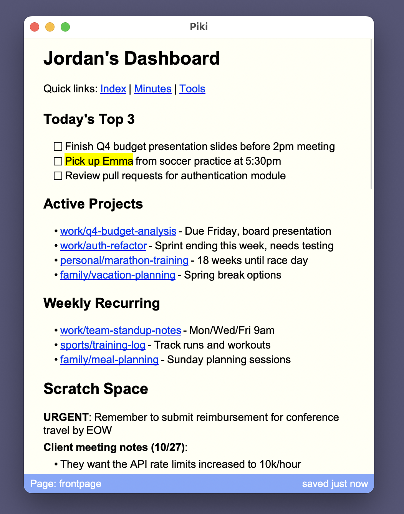

# ✜ Piki

[](https://github.com/roblillack/piki/actions)
[](https://crates.io/crates/piki)
[](https://crates.io/crates/piki)
[](https://docs.rs/piki-core)

**A personal wiki system for your markdown files**

Piki helps you manage a personal knowledge base using plain Markdown files stored on your filesystem. Take notes, create documentation, build your own wiki—all without cloud services, subscriptions, or lock-in.



## Features

- **Local-first**: Your notes are plain Markdown files on your filesystem
- **Git-friendly**: Version control your wiki with Git (optional)
- **Dual interface**: Use the CLI for quick edits or the GUI for rich text editing
- **Cross-platform**: Works on Windows, macOS, Linux, and BSD
- **Lightweight**: GUI built with FLTK featuring a custom rich-text editor
- **Fast**: Written in Rust for performance and reliability
- **Private**: No cloud service, no telemetry, no tracking
- **Open source**: MIT licensed

## Installation

### Via Cargo

```bash
cargo install piki
cargo install piki-gui
```

### System Requirements

- Rust 2024 edition (for building from source)
- For GUI: FLTK dependencies
  - **macOS**: No additional dependencies
  - **Linux/BSD**: Wayland/X11 development libraries
  - **Windows**: No additional dependencies

## Quick Start

### 1. Initialize Your Wiki

Create a directory for your notes (or use an existing one):

```bash
mkdir ~/.piki
cd ~/.piki

# Create a frontpage
echo "# John Doe's Brain" > frontpage.md
```

### 2. Launch the GUI

```bash
piki-gui
```

The GUI will open with your frontpage. Start editing, create links, and navigate between pages.

### 3. Or Use the CLI

```bash
# Edit interactively (fuzzy picker)
piki

# Edit a specific note
piki edit frontpage

# List all notes
piki ls

# View a note
piki view frontpage
```

## Configuration

Create a `~/.pikirc` file to customize your workflow:

```toml
[aliases]
# Daily notes
today = "code . -g daily/$(date +'%Y-%m-%d').md"
standup = "vim work/standup-$(date +'%Y').md"

# Git shortcuts
status = "git status -u"
sync = "git ci -m 'Auto-sync' && git pull --rebase && git push"
push = "git commit -m 'Auto-sync' && git push"

# Open in your favorite editor/IDE
code = "code ."
cfg = "vim ~/.pikirc"

# Launch GUI from CLI
g = "piki-gui"
```

## CLI Usage

### Commands

```bash
piki [options] [command]

Options:
  -d, --directory DIRECTORY   Directory containing markdown files (default: ~/.piki)

Commands:
  edit [name]   Edit a note (opens in $EDITOR or $VISUAL, defaults to vim)
  view [name]   View a note
  ls            List all notes
  log [-n NUM]  Show git commit log (if using git)
  run [cmd]     Run a shell command inside the notes directory
  help          Show help information
```

### Interactive Mode

When no command is specified, Piki opens an interactive fuzzy picker:

```bash
piki -d ~/my-wiki
# Type to filter notes, arrow keys to navigate, Enter to edit
```

### Example Workflows

```bash
# Daily note workflow
piki edit "daily/$(date +'%Y-%m-%d')"

# Quick capture
piki edit inbox

# Browse and edit
piki -d ~/my-wiki  # Interactive picker

# View without editing
piki view project-ideas

# Git integration
piki run git status
piki log -n 10
```

## GUI Usage

### Launching

```bash
# Open to frontpage
piki-gui

# Open with custom wiki path
piki-gui -d /path/to/wiki
```

### Key Features

**Rich-Text Editing**

- Live Markdown rendering as you type
- Headers (H1, H2, H3) with visual hierarchy
- Bold, italic, code, strikethrough, underline, highlighting
- Code blocks and blockquotes
- Clickable links

**Keyboard Shortcuts**

| Shortcut              | Action            |
| --------------------- | ----------------- |
| **Navigation**        |                   |
| `Cmd+N`               | New page          |
| `Cmd+P`               | Open page picker  |
| `Cmd+[`               | Back              |
| `Cmd+]`               | Forward           |
| `Cmd+Option+F`        | Jump to frontpage |
| `Cmd+Option+I`        | Open page index   |
| **Inline Styling**    |                   |
| `Cmd+B`               | Bold              |
| `Cmd+I`               | Italic            |
| `Cmd+U`               | Underline         |
| `Cmd+Shift+C`         | Inline code       |
| `Cmd+Shift+H`         | Highlight text    |
| `Cmd+Shift+X`         | Strikethrough     |
| `Cmd+K`               | Insert/Edit link  |
| `Cmd+\`               | Clear formatting  |
| **Paragraph Styling** |                   |
| `Cmd+Option+0`        | Text paragraph    |
| `Cmd+Option+1`        | Header 1          |
| `Cmd+Option+2`        | Header 2          |
| `Cmd+Option+3`        | Header 3          |
| `Cmd+Shift+5`         | Blockquote        |
| `Cmd+Shift+6`         | Code block        |
| `Cmd+Shift+7`         | Numbered list     |
| `Cmd+Shift+8`         | Bulleted list     |
| `Cmd+Shift+9`         | Checklist         |

**Auto-Save**

- Changes are saved automatically
- Status bar shows save status and last save time
- Creates parent directories as needed

**Link Formats**

- Standard Markdown: `[text](page.md)`
- Wiki-style: `[[PageName]]`
- Nested paths: `[[folder/page]]`

**Plugin System**

- Dynamic pages with `!` prefix
- Built-in `!index` plugin lists all pages
- Plugin pages are read-only
- Extensible for custom dynamic content

## Git Integration

Piki works seamlessly with Git for version control:

```bash
cd ~/.piki
git init
git add .
git commit -m "Initial wiki"

# Use piki's git commands
piki log
piki run git status

# Or use aliases in .pikirc
piki sync    # Commit, pull, push
piki push    # Commit and push
```

## Platform Support

Piki is fully cross-platform:

| Platform    | CLI | GUI | Notes                           |
| ----------- | --- | --- | ------------------------------- |
| **macOS**   | ✅  | ✅  | Native menu bar support         |
| **Linux**   | ✅  | ✅  | X11 or Wayland required for GUI |
| **Windows** | ✅  | ✅  | Fully supported                 |
| **BSD**     | ✅  | ✅  | FreeBSD, OpenBSD, etc.          |

## Architecture

Piki is organized as a Cargo workspace:

- **`core/`** - Shared library (document store, plugins)
- **`cli/`** - Command-line interface
- **`gui/`** - FLTK-based graphical interface

## Philosophy

**Local-First**
Your notes are plain text files on your filesystem. No databases, no proprietary formats, no cloud services.

**Privacy**
No telemetry, no tracking, no data leaving your machine. Your personal knowledge stays personal.

**Interoperability**
Markdown files work with any editor or tool. Use Piki alongside VS Code, Obsidian, vim, or anything else.

**Simplicity**
Fast startup, minimal dependencies, straightforward workflows. A tool that gets out of your way.

## Contributing

Contributions are welcome! Some ideas:

- [ ] Package managers (Homebrew, apt, Chocolatey, AUR)
- [ ] Full-text search across all pages
- [ ] Backlinks and page graph
- [ ] Custom syntax highlighting themes
- [ ] Mobile companion app
- [ ] Web server mode (read-only)
- [ ] Additional plugins (calendar, task list, etc.)

See the [issues](https://github.com/roblillack/piki/issues) page on GitHub.

## License

MIT License
